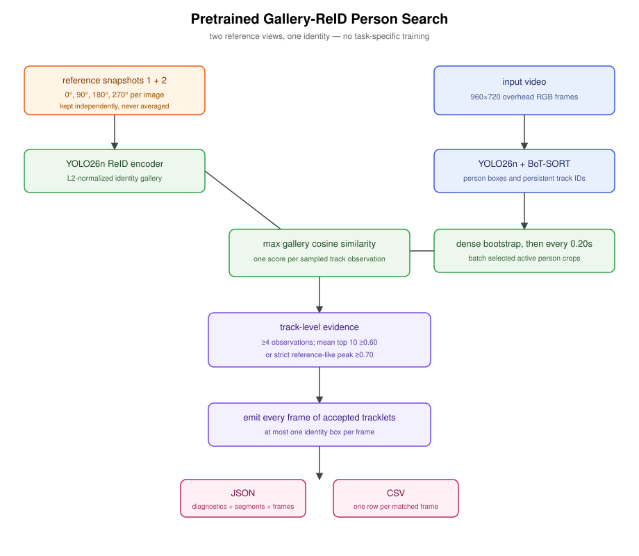

# Pretrained Reference-Photo Person Search — Architecture

## Purpose and constraints

The system locates the known person shown in the two supplied snapshots. No
labeled dataset is available, so the snapshots form a query gallery rather
than training data. The input is a 960×720, 25 fps RGB overhead/fisheye video
with no depth stream or calibration metadata.

## Data flow



```text
reference photos ─→ four right-angle views per photo ─→ ReID gallery
                                                          │
video ─→ YOLO26n ─→ BoT-SORT ─→ bootstrap + sampled embeddings ─┤ cosine similarity
                         │                                │
                         └─→ every-frame boxes            ▼
                                              track-level candidate scores
                                                          │
                               aggregate ≥ 0.60 or peak ≥ 0.70
                               (at least four observations required)
                                                          ▼
                                    all frames for accepted tracklets
                                              ┌───────────┴───────────┐
                                              ▼                       ▼
                                       JSON and CSV          second video decode
                                                                      │
                                                                      ▼
                                                        full-frame annotated PNGs
```

## Components and decisions

### Detection and tracking

`PersonTracker` runs COCO-pretrained `yolo26n.pt` for class `person` at a
0.20 confidence floor. The lower floor helps recall in this near-nadir view.
The project-owned `config/botsort_reid.yaml` enables BoT-SORT appearance
matching, disables unnecessary camera-motion compensation, and retains lost
tracks for 50 frames. `model: auto` lets Ultralytics use detector features or
its classification fallback without loading the query ONNX model twice.

### Reference gallery and sampled matching

`ReferenceMatcher` wraps Ultralytics' `ReID` implementation with
`yolo26n-reid.onnx`. Each reference and its 90°, 180°, and 270° rotations is
embedded separately and L2-normalized. References are never averaged. A new
track is embedded on every observed frame until it has four observations;
established tracks then use a 0.20-second cadence. This dense bootstrap is
necessary for bottom-border passages that exist for fewer than five frames.
Selected person boxes are embedded as one batch, and an observation score is
its maximum cosine similarity to any gallery view. Gallery embeddings remain
grouped by original source image as well as flattened for identity scoring, so
each observation retains its per-reference scores and deterministic winning
reference.

The original supplied views have cosine similarity 0.277. The configured 0.40
consistency check therefore warns while retaining both exemplars, which is the
intended behavior for divergent views.

### Track-level selection

Tracks with fewer than four sampled embeddings are ignored. The normal track
confidence is the mean of its ten strongest observations. A track is accepted
when that aggregate is at least 0.60. A short track may instead qualify when
its peak is at least 0.70; the same four-observation minimum prevents a lone
detection from triggering this path.

All box coordinates are retained during the inference pass. Once tracklets
are selected, every detected frame belonging to them is reported, including
frames between embedding samples. If accepted tracklets overlap, the stronger
selection score wins, followed by sampled similarity and track ID as stable
tie-breakers. No candidate passing either threshold produces `not_found`.

## Interfaces and output

Repeated `--reference` arguments describe one identity gallery. `--label`
defaults to `tag_wearer`. `--annotated-dir` selects the PNG directory and
defaults to `<output JSON stem>_frames`. JSON keeps the top-level `tag_wearers`
array for compatibility but emits one entry with `reference_images`,
`reference_evidence`, `status`, `accepted_track_ids`, `track_confidence`,
`annotated_images_dir`, `annotation_image_count`, segments, and frames.

Each frame contains `frame_id`, timestamp, track ID, bottom-center pixel and
normalized coordinates, the qualifying track score, `matched_reference_image`,
`matched_reference_index`, and `reference_similarity`. Unsampled frames inherit
the nearest observation in their contiguous track segment. The target-level
`reference_evidence` summarizes status, supporting tracks, frames, and segments
for each source image. JSON-only `candidate_tracks` exposes the five strongest
aggregate candidates and per-reference diagnostics. CSV contains one row per
emitted frame and joins gallery paths with `;`.

After acceptance, the source video is decoded a second time without rerunning
inference. Each accepted track box is clipped to the source dimensions and
drawn as a 3-pixel red rectangle on a full-resolution PNG. The dedicated
annotation directory contains one deterministic `frame_*_track_*.png` file per
emitted row, and both JSON and CSV expose its path as `annotation_image`. Before
export, only files matching that generated-name pattern are removed, preventing
stale detections without deleting unrelated files.

## Failure behavior

- Missing or unreadable references fail before video processing.
- Invalid rotations fail configuration validation.
- Zero-norm or missing candidate embeddings score zero.
- Short tracks cannot qualify, even with one high similarity.
- An absent or ambiguous target is not force-selected.
- A no-match result creates or cleans the annotation directory and reports an
  image count of zero.
- An unreadable video frame or failed PNG write aborts with an explicit error.
- Model weights are downloaded on first use and must already be local for an
  offline deployment.

## Verification

The 20-test suite covers dependency-injected gallery matching, sampling,
aggregation, box clipping, exact red rendering, deterministic filenames,
generated-file cleanup, and JSON/CSV image links without downloading model
weights. The end-to-end sample run validates model loading, batching, BoT-SORT,
46 unique 960×720 annotated images, schema consistency, and the known frame-506
target. Measured evidence is in `result.md`.
